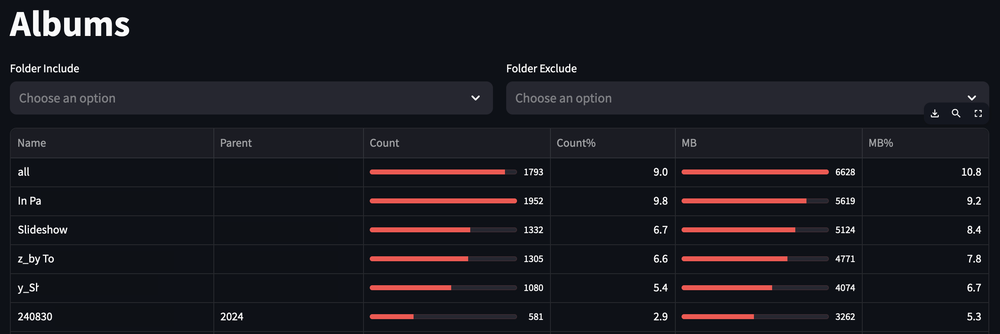
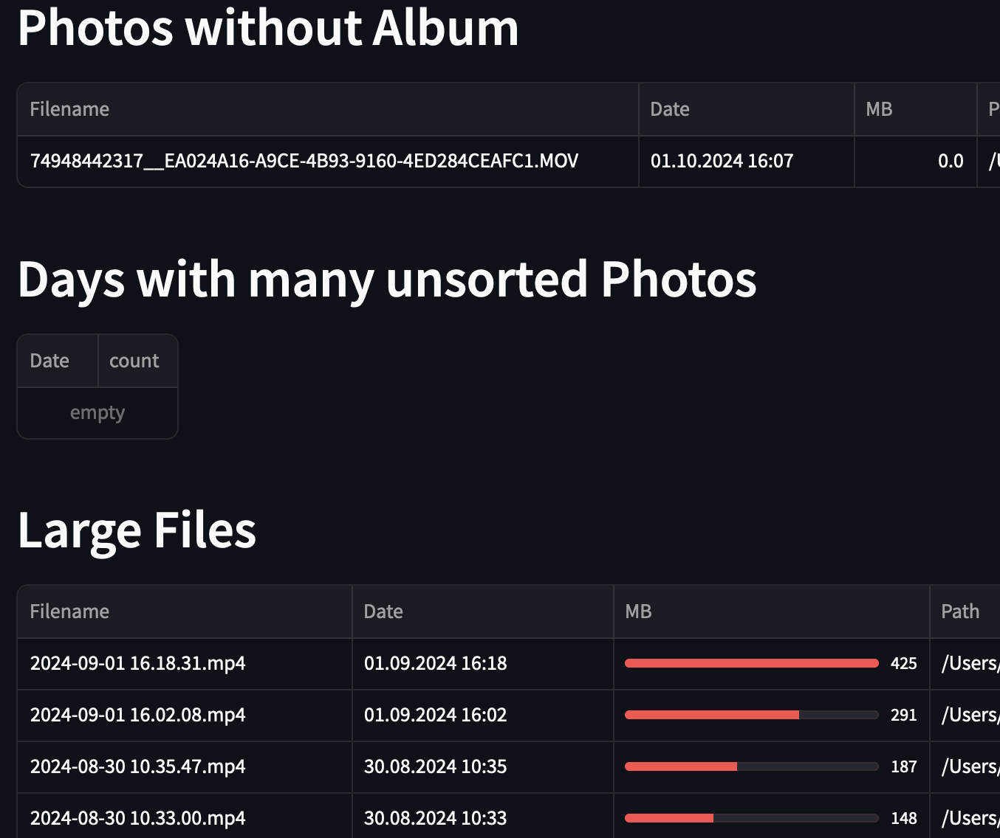

# Analyze your Mac Photos App Library

powered by [osxphotos](https://github.com/RhetTbull/osxphotos) and [Streamlit](https://github.com/streamlit/streamlit)

## Features

* find large photos/videos
* ranking of albums by MB and item count

## Repo Setup

Note: Migration from pip to UV failed with: `ModuleNotFoundError: No module named 'pkg_resources'`

### Config

see [.streamlit/config.toml](.streamlit/config.toml)
